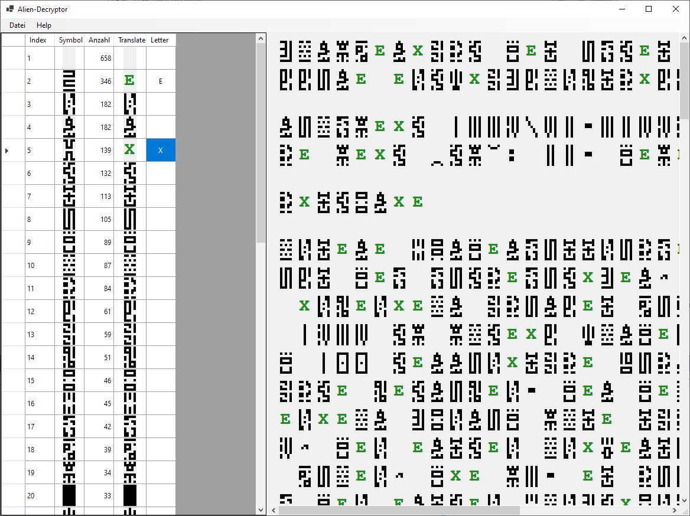

# c't Rätsel 23/2023 Teil 3: Alien-Chinesisch

Hilfprogramm, mit dem der Alientext aus [ct 23/2023](https://www.heise.de/select/ct/2023/23/2325106080475356764) entschlüsselt werden kann.

Dieses Programm ist in C# .NET 6.0 geschrieben. Es kann mit folgenden Entwicklungsumgebungen kompiliert werden:

 * [Visual Studio Code](https://code.visualstudio.com/) mit den nötigen [Extensions](https://code.visualstudio.com/docs/languages/dotnet).
 * Visual Studio 2022

## Screenshot

